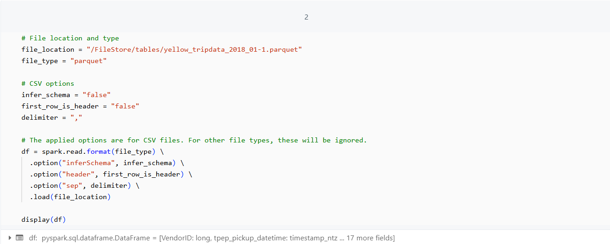
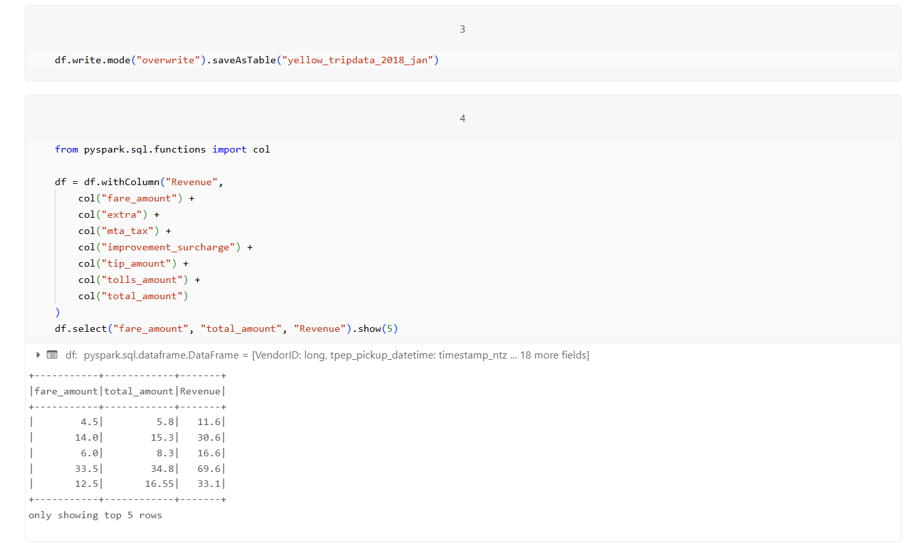
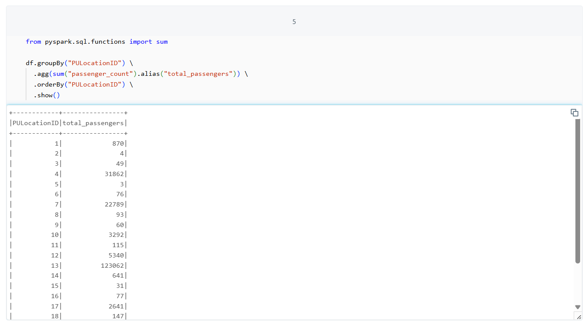
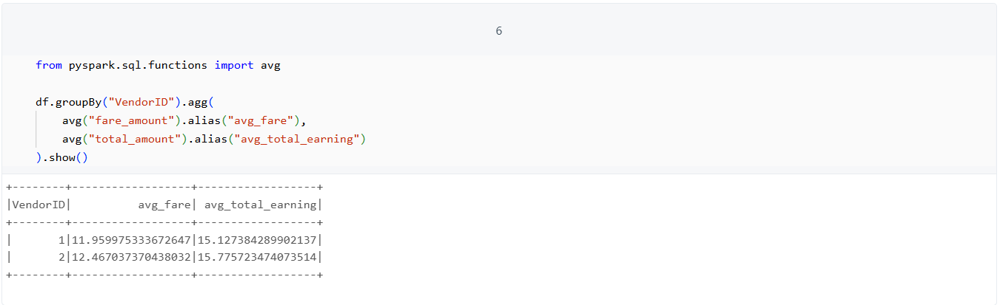
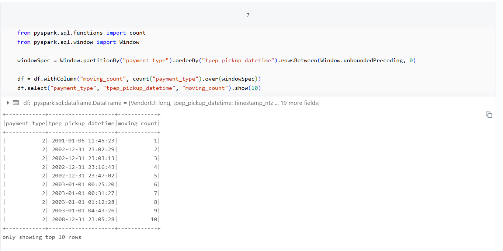
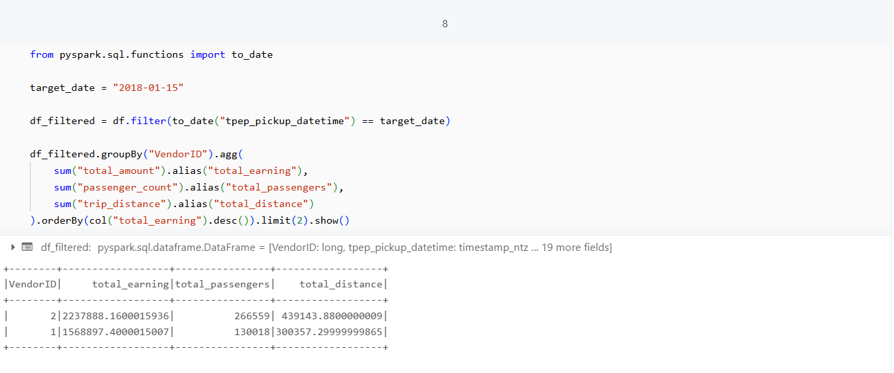
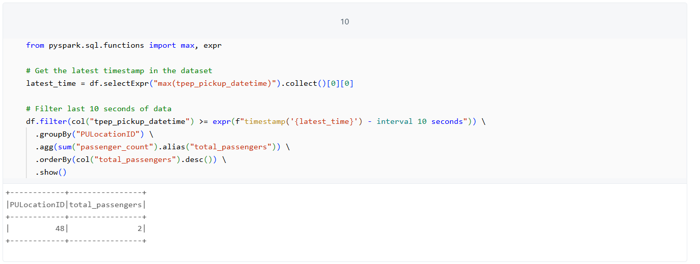

# 🚕 NYC Yellow Taxi Data Analysis using PySpark (Databricks)

This project demonstrates analysis of NYC Yellow Taxi trip data using **Apache Spark (PySpark)** in **Databricks**. The dataset is ingested in **Parquet** format and analyzed to extract insights about passenger counts, earnings, locations, and revenue.

---

## 📁 Dataset Used

The dataset is a sample of **NYC Yellow Taxi trips** (`yellow_tripdata_2018-01.parquet`), which includes pickup/drop-off times, locations, payment types, fare details, and more.

---

## 🧪 Project Objectives

This notebook performs the following analytical tasks using **Spark SQL and DataFrames**:

1. **Load and Inspect Dataset**  
   📌 Loaded from a parquet file using `spark.read.format("parquet")`.

2. **Add Revenue Column**  
   💰 Revenue = fare + tip + tolls + surcharges + taxes

3. **Passenger Count by Pickup Location**  
   🔍 Aggregated total passengers by `PULocationID`.

4. **Average Fare & Earnings per Vendor**  
   📊 Used `avg()` to compute average fare and earnings by `VendorID`.

5. **Moving Count by Payment Type Over Time**  
   🔁 Used `Window` function to create a running count for each payment type.

6. **Top Vendor Analysis (Earnings, Distance, Passenger Count)**  
   📈 On a specific date (`2018-01-15`), determined top vendors by earnings.

7. **Most Frequent PU-DO Pair (Pickup-Dropoff)**  
   📍 Found the top route with the highest number of passengers.

8. **Last 10 Seconds of Data Analysis**  
   ⏱️ Extracted records from the latest 10 seconds of available data.

---

## 📸 Output Snapshots

> Screenshots of important analysis steps and results:

- ✅ Parquet File Load  
  

- ✅ Revenue Column Addition  
  

- ✅ Passenger Counts by PU Location  
  

- ✅ Average Fare and Earnings  
  

- ✅ Moving Count by Payment Type  
  

- ✅ Most Frequent Route (PU-DO Pair)  
   <!-- Add if screenshot exists -->

- ✅ Top Vendors by Earnings  
  

- ✅ Data from Last 10 Seconds  
  

---

## 📦 Technologies Used

| Tool/Language | Purpose |
|---------------|---------|
| **Apache Spark (PySpark)** | Big data processing |
| **Databricks** | Development and execution |
| **Parquet** | Efficient data format |
| **Python** | Programming language |

---

## 📝 How to Run

1. Upload the parquet dataset to Databricks `/FileStore/tables/`
2. Import the notebook or run code snippets in a new Databricks notebook.
3. Make sure the **cluster is running** with a Spark-enabled runtime.
4. Adjust file paths and field names as per your data schema.

---

## 🧠 Insights Drawn

- Vendor 2 had the highest earnings on 2018-01-15.
- Most passengers originated from location ID 13.
- Pickup and drop at location 264 saw the maximum passenger count for a route.
- Vendor 2 provided slightly better average fare than Vendor 1.
- Significant variation exists in payment type usage over time.

---
#Assignment 8
- Aditya Kumar Pandey
